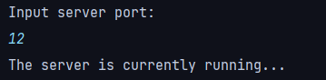
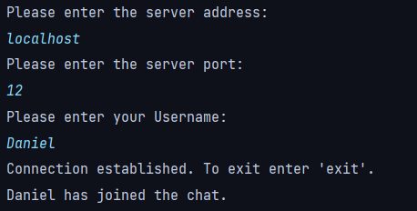
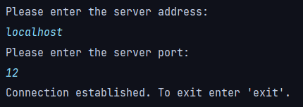
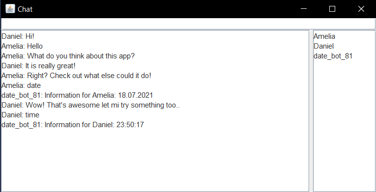

# ChatApp

Project of simple windowed chat application to talk with 
other users or use custom-written bots, if needed. 
The purpose of the project is to touch
different code aspects such as:

- Working with sockets
- Using serialization and deserialization
- Creating and synchronize multi-threaded application
- Using volatile modifier, synchronized blocks and working with *java.util.concurrent;* library
- Apply MVC design pattern
- Use inner, nested classes
- Work with Swing

----------------------------------------------------

# Opening the application window

In order to properly start the application
window you need to do the following steps:

1. Run the **Server.main()** to start the main server.
     1. Type port (ex. 12). You should receive the message "*The server is currently running*".
    
    

2. You can run the **Client.main()**, to add additional participants
   (this will also work if someone tries to connect remotely).
    1. Then you will be asked to enter server address 
       and server port which in case of this example are
       *localhost* and *12*.
    2. Next step is to enter the user name of new participant.
    
    

3. Run the **BotClient.main()** to let the bots connect.
     1. Enter the **localhost** when asked for server address (this is your own PC server address).
     2. When asked for the server port enter the same as you entered in the previous step.
        Then you should see the message "*Connection established. To exit, enter 'exit'.*"
        
    

4. Run the **ClientGuiController.main()** in order to start application window.
     1. You will be asked again to enter the port and the server address, which are in this 
        case *12* and *localhost*. Then you will be asked to enter your *username*.
5. If everything done correctly you should receive something like this:    

    
   
------------------------------------
# Commands handled by bot:

List of commands that bot is capable of handling:

- "date" for the current date.
- "day" for the current day of month.
- "month" for the current month.
- "year" for the current year.
- "time" for the current time.
- "hour" for the current hour.
- "minutes" for the minutes of current hour.
- "seconds" for the number of seconds in the current minute.
